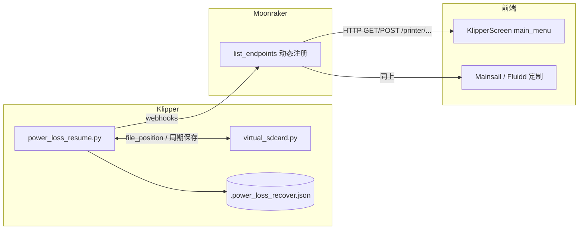

# FlyOS 断电续打（Power Loss Resume）完整逻辑

本文档描述 FlyOS rootfs 中**断电续打**的实现闭环。另一 Agent 应优先按「数据流 → 文件 → API」顺序理解；修改时勿漏 `virtual_sdcard` 与 `power_loss_resume` 的耦合。

---

## 1. 功能目标

- 打印过程中在断电、关机键、Klipper shutdown、部分异常路径下，把**可恢复状态**写入磁盘。
- 主机重启后，**Klipper** 读出该状态；**Moonraker** 将 Klipper 注册的 webhook 暴露为 HTTP/WebSocket；**网页（Mainsail/Fluidd）**与 **KlipperScreen** 查询后弹窗询问是否续打；用户确认后从 G 代码文件**断点位置**恢复打印。

---

## 2. 架构总览

---

## 3. Klipper 核心模块

### 3.1 模块文件

| 角色 | 路径（相对 FlyOS rootfs） |
|------|---------------------------|
| 续打主逻辑 | `data/klipper/klippy/extras/power_loss_resume.py` |
| 虚拟 SD（含 PLR 钩子） | `data/klipper/klippy/extras/virtual_sdcard.py` |

`virtual_sdcard` 为 **FlyOS 修改版**（例如 `import psutil`、层切换关键字、`power_loss_resume` 回调），**不能**仅用上游 Klipper 的同名文件替换而不做合并。

### 3.2 配置段

- 用户需在 `printer.cfg` 中包含 `[power_loss_resume]`（及宏），示例见 `usr/share/printer_data/config/plr.cfg` 或打包用 `packaging/plr-one-click/bundle/plr.cfg.example`。
- 关键项：`power_pin`（按钮/电源检测）、`start_gcode` / `shutdown_gcode` / `layer_change_gcode`、`layer_count`、`paused_recover_z`、`is_shutdown`。
- 宏模板中通过 **`PLR`** 字典访问断电前保存的字段（位置、温度、`print_stats` 等）。

### 3.3 持久化文件

- 常量：`INFO_FILE = ".power_loss_recover.json"`（见 `power_loss_resume.py`）。
- **实际路径**：在 `klippy:ready` 中设为 `dirname(virtual_sdcard.sdcard_dirname) + "/" + INFO_FILE`，即与 **`[virtual_sdcard]` 的 path 目录同级**，不是固定 `/usr/share/`（默认占位仅在未就绪前）。

### 3.4 何时写入 `power_loss_info`

- **`klippy:analyze_shutdown`**：Klipper 分析关机原因时调用 `_save_power_loss_info()`。
- **`power_pin` 按钮回调**（`state == 0`）：先 `_save_power_loss_info()`，再 `_shutdown()`（执行 `shutdown_gcode`，可选 `shutdown_machine`）。
- **`virtual_sdcard.work_handler`**：打印循环中与 PLR 相关的保存/清除（完成打印时 `power_loss_resume: False`；异常路径可能保存快照等）。具体行号以当前 `virtual_sdcard.py` 为准，搜索 `power_loss_resume`。

### 3.5 打印机对象与 G 代码

- **对象名**：`power_loss_resume`。
- **`get_status`**：返回 `power_loss_resume`（布尔），表示是否存在**有效**续打信息（需同时满足 `file_path`、`print_stats.filename` 等条件）。
- **G 代码命令**：
  - `START_POWER_LOSS_RESUME`：开始续打流程。
  - `CLEAR_POWER_LOSS_RESUME`：清除续打信息文件中的有效内容。

### 3.6 续打执行逻辑（摘要）

`_handle_power_loss_resume()` 大致顺序：

1. 校验 `power_loss_info` 完整性。
2. `virtual_sdcard._reset_file()`，恢复 `print_stats` 与工具头位置等。
3. 渲染并执行 **`start_gcode`**（上下文含 `PLR`）。
4. 注入同步坐标/挤出模式的 G 行（`G90`/`G91`、`M82`/`M83`、`G92 E` 等）。
5. 按保存的 **`file_position`** 打开文件，**回退到上一行换行符**，设置 `virtual_sdcard` 的文件指针与 `is_pwr_loss_resume` 等标志。
6. 调用 **`virtual_sdcard.do_resume()`**。
7. 成功后 **`_save_power_loss_info(False)`** 清除断点记录。

---

## 4. Klipper Webhooks（经 Moonraker 暴露）

在 `power_loss_resume.py` 中注册：

| Klipper endpoint 名 | 典型 Moonraker HTTP 路径 |
|---------------------|---------------------------|
| `power_loss_resume/get_info` | `GET/POST /printer/power_loss_resume/get_info` |
| `power_loss_resume/start_print` | `GET/POST /printer/power_loss_resume/start_print` |
| `power_loss_resume/clear_info` | `GET/POST /printer/power_loss_resume/clear_info` |

Moonraker 在连接 Klipper 后通过 **`list_endpoints`** 动态注册，无需单独 Moonraker 补丁。

**`get_info` 响应**（概念结构）：`power_loss_info` 内含 `power_loss_resume`、`file_path`、`progress`、`filename` 等（见 `_handle_get_power_loss_resume_info`）。

---

## 5. KlipperScreen

在本仓库中，与断电续打相关的改动**仅涉及两个文件**（全库 `grep power_loss|plr` 可验证）：`panels/main_menu.py`（业务与 UI）、`screen.py`（订阅与初始化查询）。无独立配置文件；翻译使用 `_('Unfinished tasks detected')` 等 **gettext**。

### 5.1 `data/KlipperScreen/screen.py`

| 位置 | 改动 |
|------|------|
| `ws_subscribe()` 内 `requested_updates["objects"]` | 增加 **`"power_loss_resume": None`**，与 Moonraker 做 **objects 订阅**，持续接收 Klipper `power_loss_resume` 对象状态。 |
| 打印机初始化时 `printer/objects/query` 的 `items` 元组 | 增加 **`'power_loss_resume'`**，保证首屏拉取时带上该对象（与订阅一致）。 |

### 5.2 `data/KlipperScreen/panels/main_menu.py`

| 符号 / 方法 | 作用 |
|-------------|------|
| **`ignore_plr`** | 实例变量，初始 `False`；用户点弹窗「取消」后置 `True`，本会话不再提示续打。 |
| **`check_power_loss_info()`** | `printer.state` 需为 ready；先发 WS `printer.power_loss_resume.get_info`，再以 REST **`printer/power_loss_resume/get_info`** 取 `power_loss_info`；若 `power_loss_resume` 且未 `ignore_plr`，则预拉文件元数据，`2s` 后调 **`confirm_plr_print`**。 |
| **`confirm_plr_print`** | 构建 Gtk 对话框：标题 *Unfinished tasks detected*、缩略图（可选）、**`get_file_info_extended(filename)`** 展示扩展信息；三按钮见下。 |
| **`confirm_plr_print_response`** | **OK** → `printer.power_loss_resume.start_print`；**REJECT** → `clear_info`；**CANCEL** → 仅 `ignore_plr = True`。 |
| **`show_fullscreen_thumbnail` / `close_fullscreen_thumbnail`** | 缩略图全屏查看（续打弹窗辅助）。 |
| **`get_file_info_extended`** | 为续打弹窗组装文件元数据（修改时间、层高、耗材、切片器等）；**仅被 `confirm_plr_print` 使用**。 |
| **`activate()`** | 进入主菜单时调用 **`check_power_loss_info()`**。 |

### 5.3 行为摘要

| 项 | 说明 |
|----|------|
| 触发 | 主菜单面板 **`activate()`** → **`check_power_loss_info()`**。 |
| 条件 | `printer.state` 为 ready；`plr_info['power_loss_resume']` 且 `not ignore_plr`。 |
| 弹窗延迟 | **`GLib.timeout_add_seconds(2, ...)`** 后弹出（给元数据请求留时间）。 |

**移植提示**：合并上游 KlipperScreen 时至少需保留 **§5.1** 两处订阅/查询，以及 **§5.2** 整段主菜单逻辑；否则触屏端不会出现续打提示。

---

## 6. 网页端（Mainsail / Fluidd）

**资源位置（本仓库）**：`data/mainsail/assets/index-DvCKZ4zf.js`、`data/fluidd/assets/index-D--LWRoS.js`（文件名随构建哈希变化）；中文文案见 `data/fluidd/assets/zh-CN-*.js`。**上游官方 Mainsail/Fluidd 通常不含以下逻辑**，FlyOS 为定制构建。

### 6.1 与 Klipper 交互（两者相同）

| WebSocket 方法 | 作用 |
|----------------|------|
| `printer.power_loss_resume.get_info` | 拉取续打详情，供 Vuex 写入 `power_loss_resume_info` |
| `printer.power_loss_resume.start_print` | 用户确认续打 |
| `printer.power_loss_resume.clear_info` | 用户清除断点记录 |

依赖 Vuex 中 **`printer.power_loss_resume`**（objects 订阅）与 **`power_loss_resume_info`**（`get_info` 返回）。弹窗一般展示 **文件名、说明、缩略图（若有）**。

### 6.2 Mainsail（打包组件逻辑摘要）

- **UI**：独立 **`v-dialog`**（`max-width: 400`），内层为带图标的 **Panel** 卡片；可选 **大缩略图** `gcodefile.big_thumbnail`；正文为插值文案。
- **i18n 键**：`Dialogs.PowerLossResume.Title`、`Headline`、`Message`（`Message` 带 **`filename`** 参数）、`Cancel`、`Resume`。
- **`showDialog` 计算属性**：
  - 若 **`printerIsPrinting`** 或 **`!klipperReadyForGui`** → 不显示。
  - 读取 **`$store.state.printer.power_loss_resume.power_loss_resume`** 为 `s`。
  - 当 `s` 为真且 **`power_loss_resume_info` 尚未填充**时，**副作用**：`$socket.emit("printer.power_loss_resume.get_info", …, action: "printer/getPowerLossResumeInfo")`。
  - 返回值为 `s`，用于绑定对话框 `value`。
- **按钮**：**Resume** → `startPowerLossResume` → `emit("printer.power_loss_resume.start_print")`；**Cancel** → `clearPowerLossResumeInfo` → `emit("printer.power_loss_resume.clear_info")`；点遮罩/ESC → `closeDialog`。
- **Vuex**：action **`getPowerLossResumeInfo`** → **`commit("setPowerLossResumeInfo", payload)`**。

### 6.3 Fluidd（打包组件逻辑摘要）

- **默认英文**嵌在 `app.power_loss_resume.dialog`（`title` / `help` / `btn.continue` / `btn.clear`）；中文走 **`app.power_loss_resume.dialog.*`** 翻译。
- **UI**：封装对话框组件（带 `title`、`sub-title`（文件名）、`help-tooltip`、`save-button-text`、`cancel-button-text`、`max-width: 450`）；内容区可显示 **缩略图** `img`（约 80% 宽）。
- **`@Watch("powerLossResumeInfo")` → `onPowerLossResumeInfo(e)`**：若 **`e.power_loss_resume`** 为真且 **`filename` 非空** → **`open = true`**；否则 **`open = false`**。
- **`created()`**：调用 **`printerGetPowerLossResumeInfo()`**（内部 `ye("printer.power_loss_resume.get_info", { dispatch: "printer/onGetPowerLossResumeInfo", … })`），进入界面即拉一次。
- **按钮**：**确认** → `printerPowerLossResumeStart()` → `start_print` 并关窗；**清除** → `printerPowerLossResumeClear()` → `clear_info` 并关窗。
- **Vuex**：**`onGetPowerLossResumeInfo`** → **`commit("setPowerLossResumeInfo", e.power_loss_info)`**。

### 6.4 与 KlipperScreen 对照

| 项目 | Mainsail | Fluidd |
|------|----------|--------|
| 拉取 `get_info` | 在 **`showDialog` getter** 中顺带 `emit`（与显示条件耦合） | **`created`** + 显式 **`printerGetPowerLossResumeInfo`** |
| 是否弹出 | 依赖 **`power_loss_resume` + store** 与 `showDialog` 组合 | **watch** `powerLossResumeInfo` 中 **`power_loss_resume` + `filename`** |

调试时在浏览器控制台可搜 **`power_loss_resume`**；若构建更新，变量名会压缩变化，**RPC 名与 i18n key** 相对稳定。

---

## 7. Moonraker

- 无 FlyOS 专用 `power_loss_resume` 源码补丁；依赖 Klipper 注册端点 + 动态注册。
- 确保 Moonraker 版本支持 Klippy **远程端点**转发（与官方 Moonraker 一致即可）。

---

## 8. 依赖与运行条件

- **`[virtual_sdcard]`**、`[print_stats]`、**`heaters`** 等 PLR 模块依赖项必须在配置中存在且可加载。
- **`virtual_sdcard.py`（FlyOS）** 使用 **`psutil`**：目标环境需 `python3-psutil` 或 `pip install psutil`。
- **`[buttons]`** 与 **`power_pin`**：需与硬件一致，否则关机分支行为异常。

---

## 9. 一键安装包与 Git 打包（本仓库）

| 路径 | 内容 |
|------|------|
| `packaging/plr-one-click/install.sh` | Linux 上安装 `power_loss_resume.py` + `virtual_sdcard.py` 到 `$KLIPPER_HOME` |
| `packaging/plr-one-click/bundle/` | 离线拷贝源文件与 `plr.cfg.example` |
| `packaging/plr-one-click/README.txt` | 人工步骤与限制说明 |
| `packaging/plr-one-click/make-zip.sh` | Bash 下将 `plr-one-click` 打成 zip（Git Bash / WSL / Linux） |
| `packaging/plr-git-kit/build.sh` | **仅维护者**（需 FlyOS `data/` 源码树）：生成 `out/klipper-plr-kit/`；**终端用户**直接 clone GitHub 仓库，在标准 Klipper 上运行 `install/` |
| `packaging/plr-git-kit/README.md` | `build.sh` 用法 |
| `packaging/plr-git-kit/PUBLISH_GITHUB.md` | **GitHub 新建仓库、推送、About/Topics 建议**（会复制到生成包根目录） |
| `packaging/plr-git-kit/LICENSE` | GPLv3 说明，复制到生成包根目录供 GitHub 展示 |

`plr-one-click` 前端与 KlipperScreen **不在**最小包内；**完整 Git 包**用 `plr-git-kit/build.sh`，可选 `./build.sh mainsail` 等带上网页静态资源。

---

## 10. 排障清单（给 Agent）

1. **重启后不弹窗**：检查 JSON 是否生成在 **虚拟 SD 目录旁**；`get_status` / `get_info` 中 `filename` 是否非空；前端是否为 FlyOS 定制版。
2. **续打失败**：检查 `start_gcode` 与归零、Z 安全；`file_path` 在 Moonraker 可见路径内是否存在。
3. **Klipper 报错缺模块**：确认 `power_loss_resume` 与 **修改版** `virtual_sdcard` 已同时安装。
4. **`psutil` ImportError**：安装 `psutil`。

---

## 11. 版权与来源

- `power_loss_resume.py` 文件头标注 Copyright (C) 2024 Xiaok 及 GPLv3。

---

## 12. 使用本 Skill 的建议

- 将本文件复制到 Cursor 用户 skills 目录时，可保留路径为 `flyos-power-loss-resume/SKILL.md`。
- 修改功能时同步更新 **本文档第 3–6 节**（含 **§6.2 / §6.3** 网页弹窗）与 **仓库内实际路径**，避免 Agent 与代码漂移。
- **整机移植**按 **§13** 顺序执行。

---

## 13. 移植到另一台设备（Klipper + Moonraker + 网页 + 可选 KlipperScreen）

目标：在新主机上复现 **断点保存 → 重启识别 → 网页/触屏弹窗 → 续打** 全链路。下列顺序可减少返工。

### 13.1 前置条件

- 目标机已跑通 **Klipper + Moonraker**，且 `[virtual_sdcard]` 的 **path** 与 Moonraker **gcode 路径**一致（与 FlyOS 相同惯例即可）。
- Python3 可安装 **`psutil`**（`apt install python3-psutil` 或 `pip3 install psutil`）。
- 备份目标机上现有的 **`klippy/extras/virtual_sdcard.py`**（将被 **FlyOS 修改版整体替换**，见 §8）。

### 13.2 Klipper（必做）

**推荐（标准 Klipper 安装）**：从 GitHub **克隆或下载** PLR 发行仓库到目标机，在仓库根目录执行 **`sudo bash install/install-klipper.sh`**。脚本会尝试自动发现 **`KLIPPER_HOME`**（如 `~/klipper`、`/home/pi/klipper`）与 **`printer_data`**；失败时再手动设置环境变量。无需 FlyOS 目录结构。

**备选**：手动复制 **`power_loss_resume.py`**、**`virtual_sdcard.py`** 到 **`$KLIPPER_HOME/klippy/extras/`**，或运行 **`packaging/plr-one-click/install.sh`**（bundle 布局，需 **`KLIPPER_HOME`** / **`PRINTER_DATA`**）。
2. 在 **`printer.cfg`** 中增加 **`[include plr.cfg]`**（或等价内容）。将 **`plr.cfg`** 从本仓库示例 **`packaging/plr-one-click/bundle/plr.cfg.example`** 拷到 **`printer_data/config/plr.cfg`**，并按硬件修改：
   - **`power_pin`**（与 `[buttons]`、主板引脚一致）；
   - **`start_gcode` / `shutdown_gcode` / `layer_change_gcode`**（归零策略、抬 Z、恢复温度与风扇等）。
3. **`sudo systemctl restart klipper`**（或等价重启）。

### 13.3 Moonraker（通常无需改配置）

- 官方 Moonraker 会通过 **`list_endpoints`** 自动暴露 **`/printer/power_loss_resume/*`**。重启 Moonraker 后，在目标机执行一次：

  `curl -s http://127.0.0.1:7125/printer/power_loss_resume/get_info`（按实际端口/鉴权调整）

  若 Klipper 已加载模块且曾断点，应返回 JSON；无续打时字段为假/空属正常。

### 13.4 网页端 Mainsail / Fluidd（弹窗必做）

- **官方**构建**没有**断电续打弹窗，需使用 **FlyOS 定制静态资源**：从本仓库拷贝 **`data/mainsail/`** 或 **`data/fluidd/`** 整目录覆盖目标机 nginx/caddy 所指向的 **Moonraker `web` 根目录**（具体路径依发行版，常见为 **`~/moonraker/data/www`** 或 **`/usr/share/mainsail`** 等）。
- 覆盖后**强刷浏览器缓存**或无痕窗口验证。

### 13.5 KlipperScreen（触屏端，可选）

- 若使用 KlipperScreen：将本仓库 **`data/KlipperScreen/screen.py`**、**`panels/main_menu.py`** 中与 **§5** 一致的改动合并到目标机安装目录（或整体替换同源版本需注意上游版本差异）。
- 重启 **KlipperScreen** 服务。

### 13.6 验证顺序

1. 打印中人为触发保存（或短按电源键若已接线）→ 检查 **`[virtual_sdcard]` 目录同级** 是否出现 **`.power_loss_recover.json`**。
2. 重启后 **不开始新打印**，打开网页 → 应出现续打提示；触屏进入主菜单 → 约 2s 后弹窗（见 §5）。
3. 点续打后观察是否执行 **`start_gcode`** 并从断点继续。

### 13.7 硬件与风险

- **断电检测 / 关机键** 与 **`power_pin`** 不匹配时，**shutdown 分支**不会按预期保存；需按原理图调整。
- **`virtual_sdcard.py` 与上游差异大**：若目标机曾对官方文件做过**本地修改**，需手动合并，不能直接覆盖后不管。

---
